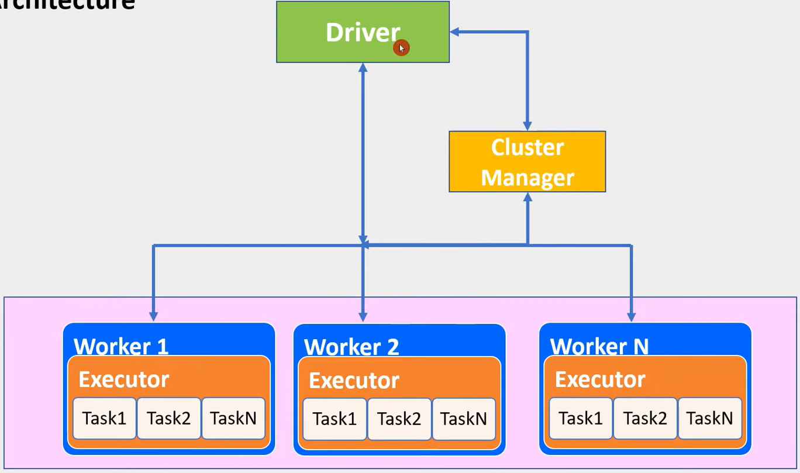
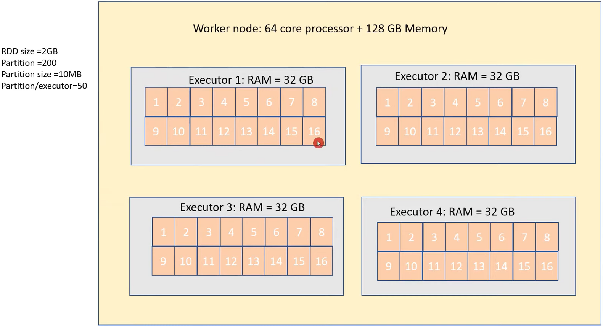

# **_[Databricks PySpark](url)_**

### **_Whats is Spark_**:
Spark is an open source distributed computing engine. We use it for processing and analysing a large amount of data. Like Hadoop, Spark laso works in distributed nature but differs in in-memory processing.

Compared to Hadoop or traditional systems, 100 times faster in memory and 10 times faster in disc.

### **_How it handles the processes at lightning speed_**?
It's ligtning speed is from in-memory and parallel processing.

Saprk has well-designed layered architecture. It follows master/slave concept. That is driver and worker concept. Between driver and worker layer comes Cluster manager layer. These layers driver, worker and cluster manager and designed well within its boundry and loosely coupled to each other.

### **_Architecture_**:

### **_Worker Node_**:

### **_Lifecycle of Spark Application_**:
1. Users submits applications
2. Driver initiates Saprk session
3. DAG creates logiccal plan
4. Task executor requests for resources from Cluster Manager
5. Cluster manager allocates resources to execute task
6. Driver establishes connection with workers and assigns task
7. Worker executes the task and returns results to driver
8. Driver returns the result to user
9. Application comes to end

### **_Saprk Attributes_**
1. Scalable
2. Fault tolerant
3. Polyglot
4. Realtime
5. Speed
6. Rich libraries

### **_Terminologies_**
#### **_1. Driver and worker process_**: 
These are nothing but JVM process. Within one worker node, there could be mutiple executors. Each executors runs its own JVM process.
#### **_2. Applications_**:
It Could be single command or combination of multiple notebooks with complex logic. When code is submitted to saprk for execution, Application starts.
#### **_3. Jobs_**:
When an application is submitted to spark, driver process converts the code into job.
#### **_4. Stage_**:
Jobs are divided into stages. If the application code demands shuffling the data across the nodes, new stage is created. Number of stages are determined by number of shuffling operations. JOIN is example of shuffling operation.
#### **_5. Tasks_**:
Stage are further divided into multiple tasks. In a stage, all the tasks would execute same logic. Each task will process 1 partition at a time. So number of partition in the distributed cluster determines the number of tasks in each stage.

